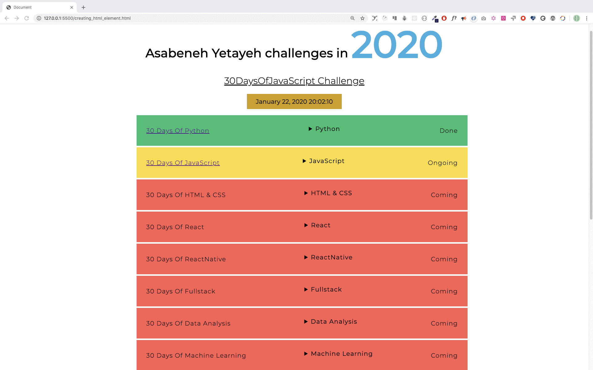
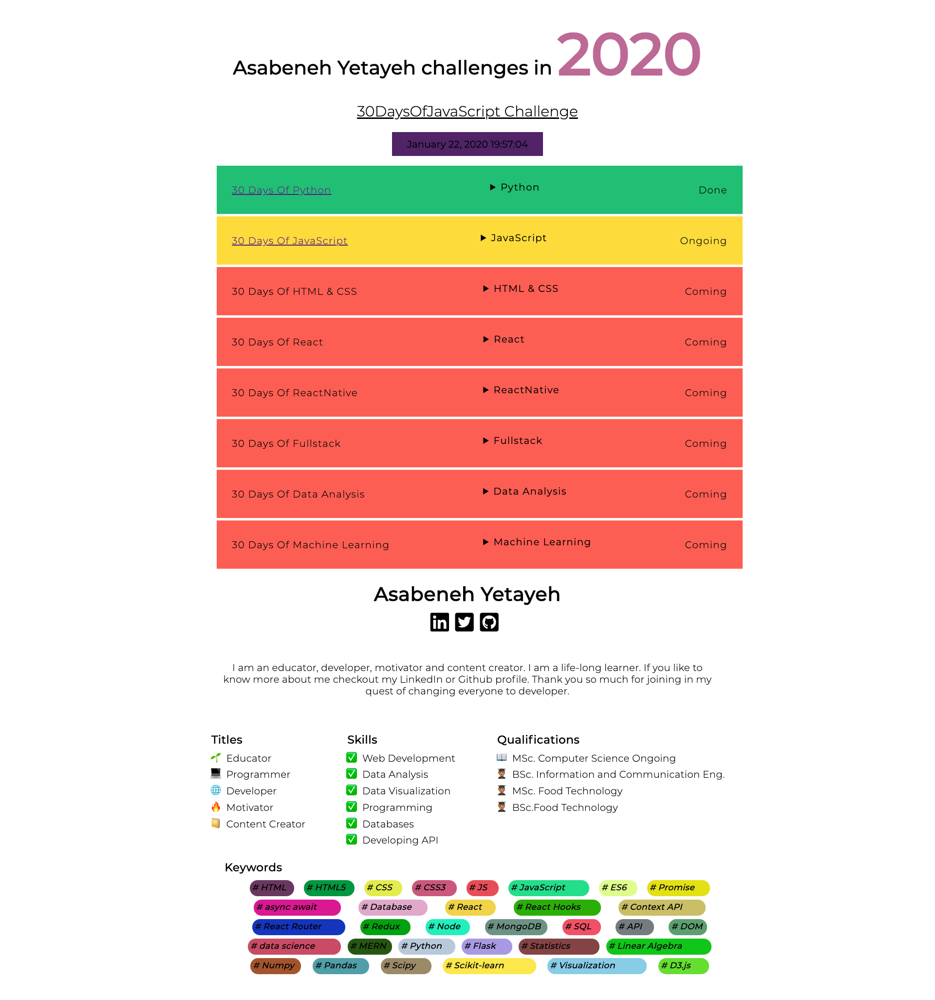

<div align="center">
  <h1> JavaScript-ning 30 kuni: DOM ob'ektini boshqarish</h1>
  <a class="header-badge" target="_blank" href="https://www.linkedin.com/in/asabeneh/">
  
  </a>
  <a class="header-badge" target="_blank" href="https://twitter.com/Asabeneh">
  
  </a>

<sub>Author:
<a href="https://www.linkedin.com/in/asabeneh/" target="_blank">Asabeneh Yetayeh</a><br>
<small> January, 2022</small>
</sub>

</div>

[<< 21-kun](../21_Day_DOM/21_day_dom.md) | [23-kun >>](../23_Day_Event_listeners/23_day_event_listeners.md)


- [22-Kun](#22-kun)
  - [DOM(Document Object Model)-2-kun](#domdocument-object-model-2-kun)
    - [Element yaratish](#element-yaratish)
    - [Elementlar yaratish](#elementlar-yaratish)
    - [Ota elementga bola element qo'shish](#ota-elementga-bola-element-qoshish)
    - [Ota elementdan bola elementni olib tashlash](#ota-elementdan-bola-elementni-olib-tashlash)
  - [Mashqlar](#mashqlar)
    - [Mashqlar: Level 1](#mashqlar-level-1)
    - [Mashqlar: Level 2](#mashqlar-level-2)
    - [Mashqlar: Level 3](#mashqlar-level-3)

# 22-Kun

## DOM(Document Object Model)-2-kun

### Element yaratish

HTML elementini yaratish uchun teg nomidan foydalanamiz. JavaScript-dan foydalanib HTML elementini yaratish juda oddiy va aniq. Biz document.createElement() usulidan foydalanamiz . Usul string parametri sifatida HTML element teg nomini oladi.

```js
// sintaksis 
document.createElement('tagname')
```

```html
<!DOCTYPE html>
<html>

<head>
    <title>Document Object Model:30 Days Of JavaScript</title>
</head>

<body>

    <script>
        let title = document.createElement('h1')
        title.className = 'title'
        title.style.fontSize = '24px'
        title.textContent = 'Creating HTML element DOM 2-kun'

        console.log(title)
    </script>
</body>

</html>
```

### Elementlar yaratish

Bir nechta elementlarni yaratish uchun biz loopdan foydalanishimiz kerak.
Loop yordamida biz xohlagancha HTML elementlarini yaratishimiz mumkin.
Elementni yaratganimizdan so'ng biz HTML ob'ektining turli xususiyatlariga qiymat berishimiz mumkin.

```html
<!DOCTYPE html>
<html>

<head>
    <title>Document Object Model:30 Days Of JavaScript</title>
</head>

<body>

    <script>
        let title
        for (let i = 0; i < 3; i++) {
            title = document.createElement('h1')
            title.className = 'title'
            title.style.fontSize = '24px'
            title.textContent = i
            console.log(title)
        }
    </script>
</body>

</html>
```

### Ota elementga bola element qo'shish

HTML hujjatida yaratilgan elementni ko'rish uchun uni ota-onaga asosiy element sifatida qo'shishimiz kerak. Biz HTML hujjat tanasiga document.body yordamida kira olamiz . document.body appendChild() usulini qoʻllab-quvvatlaydi . Quyidagi misolga qarang.

```html
<!DOCTYPE html>
<html>

<head>
    <title>Document Object Model:30 Days Of JavaScript</title>
</head>

<body>

    <script>
        //  bir nechta element yaratish va asosiy elementga qo'shish 
        let title
        for (let i = 0; i < 3; i++) {
            title = document.createElement('h1')
            title.className = 'title'
            title.style.fontSize = '24px'
            title.textContent = i
            document.body.appendChild(title)
        }
    </script>
</body>
</html>
```

### Ota elementdan bola elementni olib tashlash

HTML yaratgandan so'ng, biz element yoki elementlarni o'chirishni xohlashimiz mumkin va biz _removeChild_() usulidan foydalanishimiz mumkin.

**Example:**

```html
<!DOCTYPE html>
<html>

<head>
    <title>Document Object Model:30 Days Of JavaScript</title>
</head>

<body>
    <h1>Removing child Node</h1>
    <h2>Asabeneh Yetayeh challenges in 2022</h1>
    <ul>
        <li>30DaysOfPython Challenge Done</li>
        <li>30DaysOfJavaScript Challenge Done</li>
        <li>30DaysOfReact Challenge Coming</li>
        <li>30DaysOfFullStack Challenge Coming</li>
        <li>30DaysOfDataAnalysis Challenge Coming</li>
        <li>30DaysOfReactNative Challenge Coming</li>
        <li>30DaysOfMachineLearning Challenge Coming</li>
    </ul>

    <script>
        const ul = document.querySelector('ul')
        const lists = document.querySelectorAll('li')
        for (const list of lists) {
            ul.removeChild(list)

        }
    </script>
</body>

</html>
```

Oldingi bo'limda ko'rib turganimizdek, innerHTML xossalari usuli yordamida barcha ichki HTML elementlarini yoki asosiy elementning bolalarini yo'q qilishning eng yaxshi usuli bor.

```html
<!DOCTYPE html>
<html>

<head>
    <title>Document Object Model:30 Days Of JavaScript</title>
</head>

<body>
    <h1>Removing child Node</h1>
    <h2>Asabeneh Yetayeh challenges in 2022</h1>
    <ul>
        <li>30DaysOfPython Challenge Done</li>
        <li>30DaysOfJavaScript Challenge Done</li>
        <li>30DaysOfReact Challenge Coming</li>
        <li>30DaysOfFullStack Challenge Coming</li>
        <li>30DaysOfDataAnalysis Challenge Coming</li>
        <li>30DaysOfReactNative Challenge Coming</li>
        <li>30DaysOfMachineLearning Challenge Coming</li>
    </ul>

    <script>
        const ul = document.querySelector('ul')
        ul.innerHTML = ''
    </script>
</body>

</html>
```

Yuqoridagi kod parchasi barcha asosiy elementlarni tozaladi.

---

🌕 Siz juda o'zgachasiz, siz kundan-kunga o'sib bormoqdasiz. Endi siz yaratilgan DOM elementini kerak bo'lganda qanday yo'q qilishni bilasiz. Siz DOM-ni o'rgandingiz va endi siz ilovalarni yaratish va ishlab chiqish imkoniyatiga egasiz. Sizda buyuklikka erishish uchun bor-yo'g'i sakkiz kun qoldi. Endi miyangiz va mushaklaringiz uchun bir nechta mashqlarni bajaring.

## Mashqlar

### Mashqlar: Level 1

1. HTML hujjatida div konteyner yarating va dinamik ravishda 100 dan 100 gacha raqamlar yarating va div konteyneriga qo'shing.
    - Juft raqamlar fonida yashil rang
    - Toq raqamlar foni sariq rangda
    - Asosiy raqamlar fonida qizil rang mavjud


### Mashqlar: Level 2

1. Barcha mamlakatlarni koʻrsatish uchun mamlakatlar qatoridan foydalaning. Dizaynga qarang


### Mashqlar: Level 3

Ushbu loyiha talabini ikkala rasmdan (jpg va gif) tekshiring. Barcha ma'lumotlar va CSS faqat JavaScript yordamida amalga oshirilgan. Maʼlumotlar loyiha_3 boshlangʻich jildida joylashgan. [*Tafsilotlar*](https://www.w3schools.com/tags/tag_details.asp) HTML elementi yordamida ochiladigan tugma yaratilgan .





🎉 TABRIKLAYMAN ! 🎉

[<< 21-kun](../21_Day_DOM/21_day_dom.md) | [23-kun >>](../23_Day_Event_listeners/23_day_event_listeners.md)