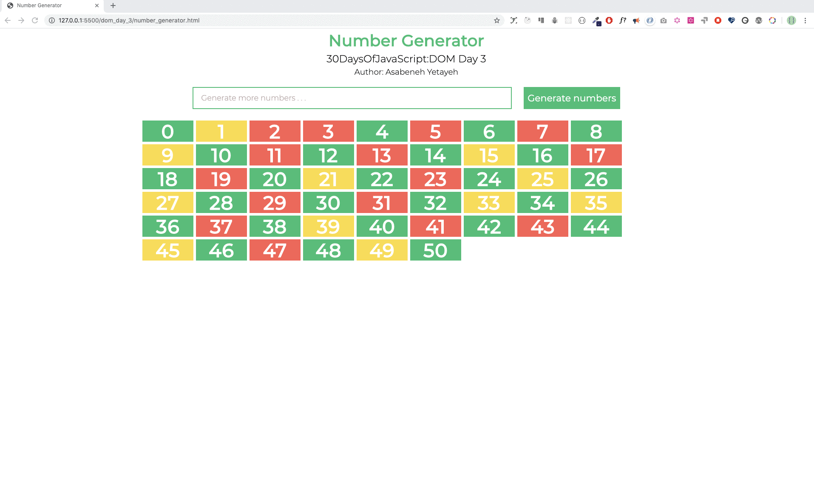
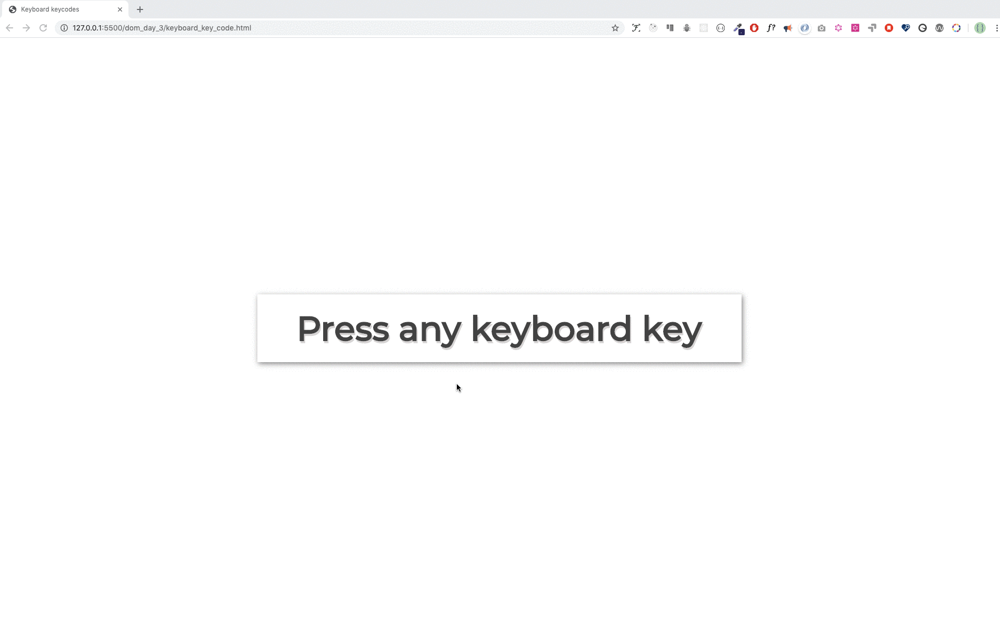

<div align="center">
  <h1> 30 kunlik JavaScript: Event Listeners (Hodisa tinglovchilari)</h1>
  <a class="header-badge" target="_blank" href="https://www.linkedin.com/in/asabeneh/">
  
  </a>
  <a class="header-badge" target="_blank" href="https://twitter.com/Asabeneh">
  
  </a>

<sub>Author:
<a href="https://www.linkedin.com/in/asabeneh/" target="_blank">Asabeneh Yetayeh</a><br>
<small> January, 2022</small>
</sub>

</div>

[<< 22-kun](../22_Day_Manipulating_DOM_object/22_day_manipulating_DOM_object.md) | [24-kun >>](../24_Day_Project_solar_system/24_day_project_solar_system.md)


- [24-Kun](#22-kun)
  - [DOM(Document Object Model)-3-kun](#domdocument-object-model-3-kun)
    - [Event Listeners (Hodisa tinglovchilari)](#event-listeners-hodisa-tinglovchilari)
      - [Click](#click)
      - [Double Click](#double-click)
      - [Mouse enter](#mouse-enter)
    - [input elementidan qiymat olish](#input-elementidan-qiymat-olish)
    - [input value](#input-value)
      - [input event and change](#input-event-and-change)
      - [blur event](#blur-event)
      - [keypress, keydow and keyup](#keypress-keydow-and-keyup)
  - [Mashqlar](#mashqlar)
    - [Exercise: Level 1](#exercise-level-1)

# 24-Kun

## DOM(Document Object Model)-3-kun

### Event Listeners (Hodisa tinglovchilari)

Umumiy HTML hodisalari: _`onclick, onchange, onmouseover, onmouseout, onkeydown, onkeyup, onload`_. Biz har qanday DOM ob'ektiga hodisa tinglovchi usulini qo'shishimiz mumkin. HTML elementlarida har xil hodisa turlarini tinglash uchun **addEventListener**() usulidan foydalanamiz. **addEventListener**() usuli ikkita argumentni oladi , voqea tinglovchisi va qayta qo'ng'iroq funksiyasi.
```js
selectedElement.addEventListener('eventlistner', function(e) {
  // hodisadan keyin sodir bo'lishini xohlagan faoliyat shu yerda bo'ladi 
})
// yoki 

selectedElement.addEventListener('eventlistner', e => {
  // hodisadan keyin sodir bo'lishini xohlagan faoliyat shu yerda bo'ladi 
})
```

#### Click

Elementga hodisa tinglovchisini biriktirish uchun avval elementni tanlaymiz, keyin addEventListener usulini biriktiramiz. Hodisa tinglovchisi argument sifatida voqea turi va qayta qo'ng'iroq funksiyalarini oladi.

Quyida **bosish**  ya'ni `click` turi hodisasiga misol keltirilgan.

**Misol: click**

```html
<!DOCTYPE html>
<html>
  <head>
    <title>Document Object Model</title>
  </head>

  <body>
    <button>Click Me</button>

    <script>
      const button = document.querySelector('button')
      button.addEventListener('click', e => {
        console.log('e gives the event listener object:', e)
        console.log('e.target gives the selected element: ', e.target)
        console.log(
          'e.target.textContent gives content of selected element: ',
          e.target.textContent
        )
      })
    </script>
  </body>
</html>
```

Hodisa to'g'ridan-to'g'ri HTML elementiga inline skript sifatida ham biriktirilishi mumkin.

**Misol: onclick**

```html
<!DOCTYPE html>
<html>
  <head>
    <title>Document Object Model</title>
  </head>

  <body>
    <button onclick="clickMe()">Click Me</button>
    <script>
      const clickMe = () => {
        alert('We can attach event on HTML element')
      }
    </script>
  </body>
</html>
```

#### Double Click

Elementga hodisa tinglovchisini biriktirish uchun avval elementni tanlaymiz, keyin addEventListener usulini biriktiramiz. Hodisa tinglovchisi argument sifatida voqea turi va qayta qo'ng'iroq funksiyalarini oladi.

Quyida bosish turi hodisasiga misol keltirilgan.
**Misol: dblclick**

```html
<!DOCTYPE html>
<html>
  <head>
    <title>Document Object Model</title>
  </head>

  <body>
    <button>Click Me</button>
    <script>
      const button = document.querySelector('button')
      button.addEventListener('dblclick', e => {
        console.log('e gives the event listener object:', e)
        console.log('e.target gives the selected element: ', e.target)
        console.log(
          'e.target.textContent gives content of selected element: ',
          e.target.textContent
        )
      })
    </script>
  </body>
</html>
```

#### Mouse enter

Elementga hodisa tinglovchisini biriktirish uchun avval elementni tanlaymiz, keyin addEventListener usulini biriktiramiz. Hodisa tinglovchisi argument sifatida voqea turi va qayta qo'ng'iroq funksiyalarini oladi.

Quyida sichqoncha element ichiga kirishi turi hodisasiga misol keltirilgan.

**Misol: mouseenter**

```html
<!DOCTYPE html>
<html>
  <head>
    <title>Document Object Model</title>
  </head>

  <body>
    <button>Click Me</button>
    <script>
      const button = document.querySelector('button')
      button.addEventListener('mouseenter', e => {
        console.log('e gives the event listener object:', e)
        console.log('e.target gives the selected element: ', e.target)
        console.log(
          'e.target.textContent gives content of selected element: ',
          e.target.textContent
        )
      })
    </script>
  </body>
</html>
```

By now you are familiar with addEventListen method and how to attach event listener. There are many types of event listeners. But in this challenge we will focus the most common important events.
List of events:

- click -  element bosilganda
- dbclick - element ikki marta bosilganda
- mouseenter -  sichqoncha nuqtasi elementga kirganda
- mouseleave -  sichqoncha ko'rsatkichi elementni tark etganda
- mousemove - sichqoncha ko'rsatkichi element ustida harakat qilganda
- mouseover -  sichqoncha ko'rsatkichi element ustida harakat qilganda
- mouseout - sichqoncha ko'rsatkichi elementdan tashqariga chiqqanda
- input - qiymat kiritish maydoniga kiritilganda 
- change - kiritish maydonida qiymat o'zgarganda
- blur - element diqqat markazida bo'lmaganda
- keydown -  kalit o'chirilganda
- keyup - kalit yoqilganda
- keypress - har qanday tugmachani bosganimizda
- onload - brauzer sahifani yuklashni tugatganida

Yuqoridagi parcha kodidagi hodisa turini almashtirish orqali yuqoridagi hodisa turlarini sinab ko'ring.

### input elementidan qiymat olish

Biz odatda shakllarni to'ldiramiz va shakllar ma'lumotlarni qabul qiladi. Shakl maydonlari kiritish HTML elementi yordamida yaratiladi. Keling, ikkita kiritish maydoni, bitta tugma va bitta p teg yordamida odamning tana massasi indeksini hisoblash imkonini beruvchi kichik dastur yarataylik.

### input value

```html
<!DOCTYPE html>
<html>
  <head>
    <title>Document Object Model:30 Days Of JavaScript</title>
  </head>

  <body>
    <h1>Body Mass Index Calculator</h1>

    <input type="text" id="mass" placeholder="Mass in Kilogram" />
    <input type="text" id="height" placeholder="Height in meters" />
    <button>Calculate BMI</button>

    <script>
      const mass = document.querySelector('#mass')
      const height = document.querySelector('#height')
      const button = document.querySelector('button')

      let bmi
      button.addEventListener('click', () => {
        bmi = mass.value / height.value ** 2
        alert(`your bmi is ${bmi.toFixed(2)}`)
        console.log(bmi)
      })
    </script>
  </body>
</html>
```

#### input event and change

Yuqoridagi misolda biz tugmani bosish orqali ikkita kiritish maydonidan kirish qiymatlarini olishga muvaffaq bo'ldik. Agar biz tugmani bosmasdan qiymat olishni istasak-chi? Maydon diqqat markazida bo'lganda, kirish maydonidan ma'lumotlarni darhol olish uchun o'zgartirish yoki kiritish hodisasi turidan foydalanishimiz mumkin. Keling, buni qanday hal qilishimizni ko'rib chiqaylik.

```html
<!DOCTYPE html>
<html>
  <head>
    <title>Document Object Model:30 Days Of JavaScript</title>
  </head>

  <body>
    <h1>Data Binding using input or change event</h1>

    <input type="text" placeholder="say something" />
    <p></p>

    <script>
      const input = document.querySelector('input')
      const p = document.querySelector('p')

      input.addEventListener('input', e => {
        p.textContent = e.target.value
      })
    </script>
  </body>
</html>
```

#### blur event

_input_ yoki _change_, _blur_ hodisasi kiritish maydoni diqqat markazida boʻlmaganda sodir boʻladi.

```js
<!DOCTYPE html>
<html>

<head>
    <title>Document Object Model:30 Days Of JavaScript</title>
</head>

<body>
    <h1>Giving feedback using blur event</h1>

    <input type="text" id="mass" placeholder="say something" />
    <p></p>

    <script>
        const input = document.querySelector('input')
        const p = document.querySelector('p')

        input.addEventListener('blur', (e) => {
            p.textContent = 'Field is required'
            p.style.color = 'red'

        })
    </script>
</body>

</html>
```

#### keypress, keydow and keyup

Biz turli xil hodisa tinglovchilari turlaridan foydalangan holda klaviaturaning barcha kalit raqamlariga kira olamiz. Keling, tugmachani bosamiz va har bir klaviatura tugmachasining kalit kodini olamiz.

```html
<!DOCTYPE html>
<html>
  <head>
    <title>Document Object Model:30 Days Of JavaScript</title>
  </head>

  <body>
    <h1>Key events: Press any key</h1>

    <script>
      document.body.addEventListener('keypress', e => {
        alert(e.keyCode)
      })
    </script>
  </body>
</html>
```

---

🌕 Siz juda o'zgachasiz, siz kundan-kunga o'sib bormoqdasiz. Endi siz har qanday DOM hodisalarini qanday boshqarishni bilasiz. . Buyuklik sari yetti kun qoldi. Endi miyangiz va mushaklaringiz uchun bir nechta mashqlarni bajaring.

## Mashqlar

### Mashq: Level 1

1. Raqamlarni yaratish va juftlik, koeffitsient va tub sonlarni uch xil rang bilan belgilash. Quyidagi rasmga qarang.



2. Hatto tinglovchi yordamida klaviatura kod kodini yaratish. Quyidagi rasm.



🎉 TABRIKLAYMAN ! 🎉

[<< 22-kun](../22_Day_Manipulating_DOM_object/22_day_manipulating_DOM_object.md) | [24-kun >>](../24_Day_Project_solar_system/24_day_project_solar_system.md)
